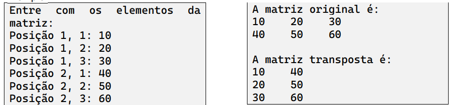

Escreva um programa em Java que leia do teclado o conteúdo de um array bidimensional (matriz)
de inteiros com duas linhas e três colunas. Após os valores terem sido carregados, o programa
deverá apresentar o conteúdo na forma original e na forma transposta.
Obs: A transposta de uma matriz reorganiza os elementos de modo que as linhas passam a
configurar-se como colunas.
Exemplo:

