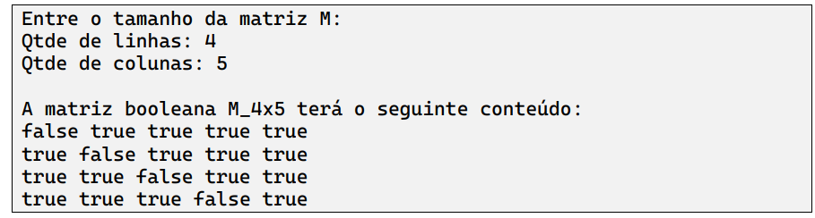

Implemente um programa que, lendo dois valores inteiros do teclado, N e M, crie uma matriz de
tamanho NxM de booleanos. O conteúdo é dado de tal forma que se os índices i e j forem iguais, o
valor é false; caso contrário, o valor é true. 

