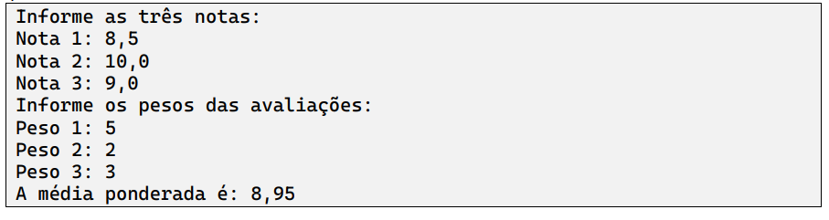

Desenvolva um programa que receba três notas e seus respectivos pesos a partir do teclado,
passando-os como argumento para um método que calcule média. A sub-rotina deverá calcular e
retornar a média ponderada das notas recebidas como parâmetro, considerando os respectivos
pesos.

