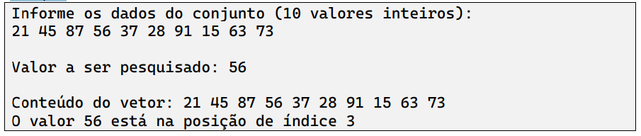

Usando linguagem Java, codifique um programa que receba um vetor de dez números inteiros e um valor a ser buscado, verificando se o valor informado está presente no vetor. Se estiver presente, informe o índice em que ele se encontra; caso contrário informe “valor não localizado”.
Exemplo:
