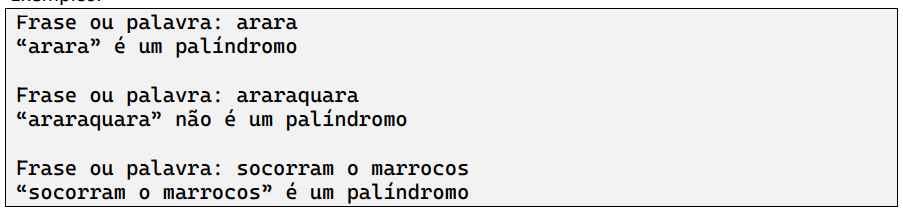

Desenvolva um método em Java que receba uma string como parâmetro e verifique se ela é um palíndromo. Para testá-lo, faça um programa que leia uma frase ou palavra do teclado e repasse a informação para o método, apresentando o resultado de acordo com o seu retorno.
Palíndromo (def.): diz-se da frase ou palavra que se pode ler, indiferentemente, da esquerda para a direita ou vice-versa.
Exemplos:

