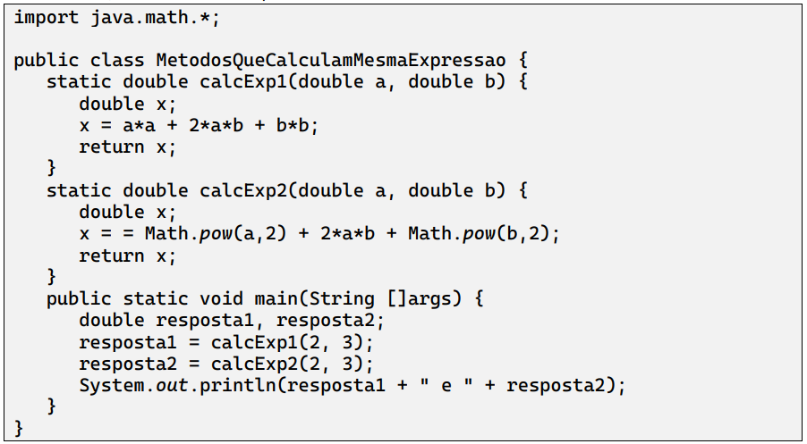

No programa abaixo há dois métodos que realizam a mesma tarefa, entretanto o fazem de maneiras diferentes. Os métodos calcExp1 e calcExp2 calculam e retornam o valor da expressão x=a2+2ab+b2, dados a e b como parâmetros. 

a) Há alguma diferença efetiva, em termos de resultado, entre usar uma e outra forma?
    R: Há um erro em calExp2. Não há mudança efetiva, os resultados são os mesmos porém utilizando Math o código se torna de melhor entendimento. 

b) Pensando em termos mais gerais, você consegue pensar em algum argumento ou situação em que o uso do método Math.pow seria mais interessante do que simplesmente realizar a multiplicação de uma variável por ela mesma?
    R: Para simplificar potenciações maiores.