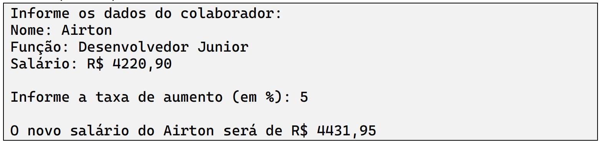

Codifique uma classe Empregado para representar colaboradores que trabalham em uma empresa, tendo nome, função e salário como atributos. Defina um método chamado atualizarSalario() para calcular e atualizar o salário de acordo com a taxa informada como parâmetro.
Faça um programa para testar a classe criada, instanciando um funcionário e coletando seus dados através do teclado. Em seguida, pedir para o usuário informar um percentual a ser dado como aumento, e então, calcular e mostrar o novo salário do colaborador.
