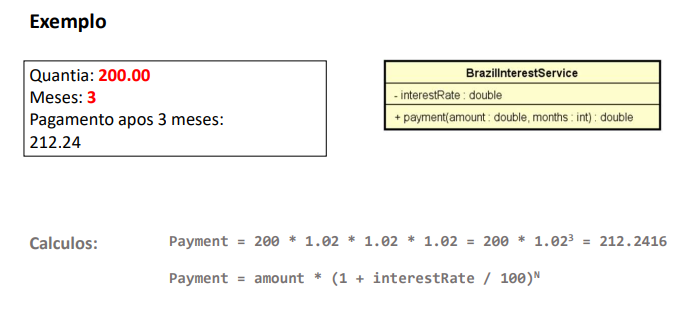

Fazer um programa para ler uma quantia e a duração em meses de umempréstimo. Informar o valor a ser pago depois de decorrido o prazo doempréstimo, conforme regras de juros do Brasil. A regra de cálculo dejuros do Brasil é juro composto padrão de 2% ao mês.

